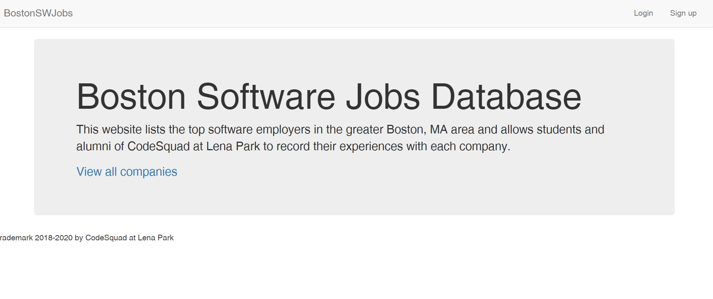
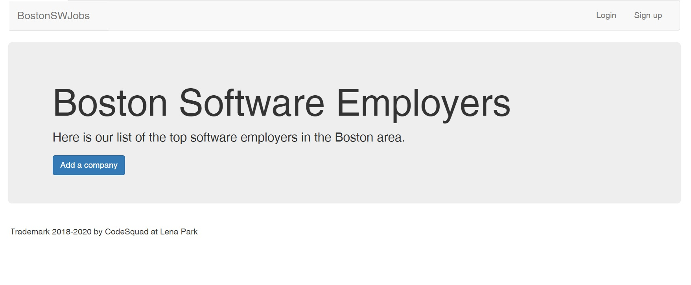
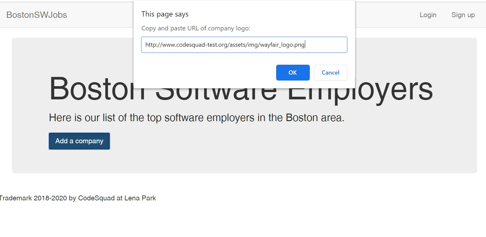
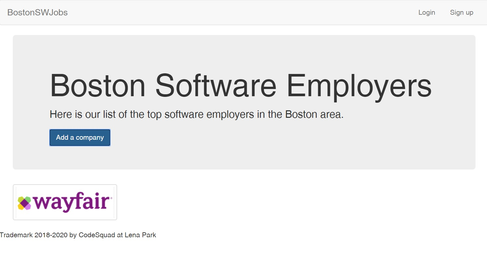
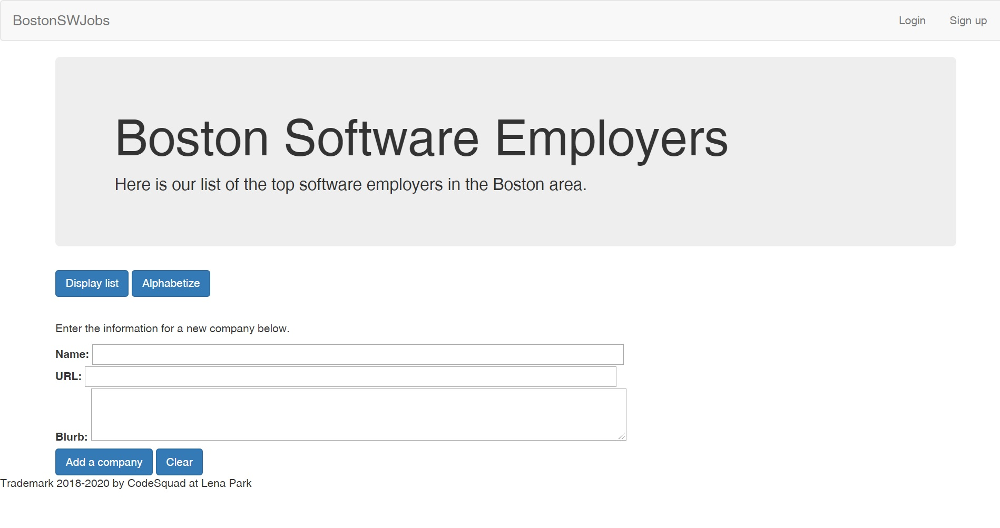

### Begin the Boston Software Jobs Database project

In this exercise we will begin to build the Boston Software Jobs Database, which will be a major project in this course. It will also serve as a coding model for you to use as you build your own Personal Project for the end of the course.

The Boston Software Jobs Database is a CodeSquad project, similar to the review site [Glassdoor](https://www.glassdoor.com/about-us/). The goal of Boston Software Jobs is to become a place to share reviews and experiences about software employers in Greater Boston -- posted specifically by CodeSquad students and graduates. The vision is that CodeSquad alums who have worked at a specific company, interviewed for a job there, met a recruiter at a job fair, etc., can post their experience in a safe space where other CodeSquad students and alums can read and learn from them.

The goal for this first part of the project, due Saturday, April 4, is to create the first two HTML files for this site, the "landing" page and the "companies" page. See mockups for how they should look.

These pages should include:

* Navbar using flexbox
* Fonts, text sizes, and colored boxes to match the mockups
* Working links to connect the Companies page to the Landing page (through the BostonSWJobs link in upper left of the page), and connecting the Landing page to the Companies page through the "View all companies" link. You can leave the Login and Signup links blank for now.
* When the user clicks the "Add a company" button on the Companies page, a pop-up should appear that asks for a URL to a corporate logo. You can use the file below **(URL list for corporate logos.txt)** for examples.
* When the user pastes in a logo URL and hits Enter, the page should display the logo in the white area below the button (see mockup).
* Optional: use Bootstrap "[jumbotron](https://getbootstrap.com/docs/4.0/components/jumbotron/)" and [button](https://getbootstrap.com/docs/4.0/components/buttons/) classes to quickly add a professional look. As you may recall, the first step in using Bootstrap is to add the Bootstrap CSS link (a CDN starting `https://maxcdn.bootstrapcdn.com...`) from their [Quick Start](https://getbootstrap.com/docs/4.0/getting-started/introduction/) page.
* BONUS: allow the user to enter **multiple** corporate logos, and have all of them display in a list (Hint: this will use a loop)

### Update Boston Software Jobs to add company names and descriptions

Using the files you created for the previous homework, add the ability for the user to display multiple companies on the Companies page. For each company, your app should collect a company name, logo, and a blurb about what the company does. Attached is a text file with blurbs and logo URLs for several companies.

For this assignment you will need a loop, and you will probably loop through an array. However, from there you have choices: you may decide to use multiple arrays (images, company names, and blurbs, for example), or you may want to use an array of objects, where each object represents a single company. This aspect of the program design is up to you.

**Note:** The mockup for this assignment uses a Bootstrap class called [thumbnail](https://getbootstrap.com/docs/4.4/content/images/) (but this is optional). If you add the class `thumbnail` to the `div` holding each company's logo and text, it will create a little gray border with slightly rounded corners. It's also a good idea to give your `div` a width (say 20% or so).

When finished, commit to a new repository, push to GitHub and submit the new URL below.

BONUS: Instead of creating a new repository, create this update as a branch on your existing project repository. Push to GitHub and submit the URL below. Don't forget to tell us the branch name!

### Boston Software Jobs - Form Inputs and an Array of Objects

In this assignment, you will update the Boston Software Jobs Database to accept user input through a form, rather than pop-up prompts. This looks more like something you would see on the Web. You will also add a "Clear" button to empty out the form. See the attached mockup:

We have provided partial HTML, CSS and JavaScript files for this exercise. The partial JS file uses an array of objects to store your list of companies. However, there is more than one way to solve this assignment - for example, you could also use multiple arrays with no objects, or other methods. You should choose the method that makes most sense to you.

Here are the specific requirements:

1. Add a new button, "Display list," which lets the user display the companies that are in memory. When a user clicks this button, the app should access the data stored in your JavaScript file and display company names, logos and descriptions. See the second mockup for how it should look.
2. Add two text inputs to your Companies page (for a refresher on text inputs, check [w3schools](https://www.w3schools.com/tags/att_input_type_text.asp)). The first text box is for the company name, and the second is for the logo URL. To make your page match the mockup, give the inputs a `size` of 90 characters (default size is 20 characters).
3. Add a third text box for the company description. You can use a text input just like in step #2, or you can use a [textarea](https://www.w3schools.com/tags/tag_textarea.asp) element.
4. Enable your app to "listen" for a click on the "Add a company" button. When a user clicks on this button, your app should capture the `value` from each text input and assign it to a variable inside your JavaScript file. How can you do this? By using a `querySelector`  and adding the `.value` method. Read more at [w3schools](https://www.w3schools.com/jsref/prop_text_value.asp).
5. The "Add a company" button and a new button, "Clear," should be placed below the text inputs ([see mockup](images/mockup/companiesMockup-FormInputs.jpg)).
6. Listen for a click on the "Clear" button. This button should empty _all three_ `input` textboxes. To do this, you can set the `value` of that text input to an empty string (`''`).

BONUS: 
Add another new button, "Alphabetize," next to the "Display list" button. The Alphabetize button should sort all the companies stored in your JS file alphabetically by company name. You can use the array `.sort()` method...but because it's an array of objects, you also need to add a compare function. For more on compare functions, check out this [sitepoint article](https://www.sitepoint.com/sort-an-array-of-objects-in-javascript/) (refer to the section "How to Sort an Array of Objects in JavaScript," about half-way down).

### Boston Software Jobs Database - add a server-based Object of Objects

In this exercise you will move your data to the server. The list of companies is an Object that contains other Objects. Inside the attached folder ([BSJ-ServerBasedObjectOfObjects.zip](./moodle-files/back-end/unit-19-add-server-based-object-of-objects/BSJ-ServerBasedObjectOfObjects.zip)), we have already created a basic server for you. There is a file called [server.js](./moodle-files/back-end/unit-19-add-server-based-object-of-objects/server.js) that is the entry point. You will need to add appropriate URL paths (endpoints) to handle browser requests. Refer to [README.txt](./moodle-files/back-end/unit-19-add-server-based-object-of-objects/README.txt) for specific instructions.

In this homework, you will create a listings page for software companies in Boston.

You are already provided with the following:

* [server.js](./server.js)  
This file contains the basic code to launch a server. You will add your URL paths here.

* [views folder](./views)  
This is an empty folder. This is where you will create your templates (.ejs files)

* [package.json](./package.json)  
This contains all the dependencies you will require to be able to launch the server. Use cd to change into the directory where [package.json](./package.json) is and RUN `npm install`

#### Tasks

1. Create a '/' GET route. Use the .render() method to render the following HTML: `"<h1> Welcome to Boston Software Jobs </h1>"` so when the user goes to localhost:3000, they should see "Welcome to Boston Software Jobs"

* Hint: You will need to create a file in the views directory and use that filename in the render() method.  
    * You can call this file [index.ejs](./views/index.ejs)

2. Create another route called '/jobs'. When the user visits 'localhost:3000/jobs', your server should display the name of all companies as an unordered list. You will need to create another file in your views directory and use that filename in the render() method.  
    * You can call this file [jobs.ejs](./views/jobs.ejs)

* Hint 1: You will need to send the names of the companies through render, like this: `response.render(FILE_NAME, {names: companies})`

* Hint 2: From the COMPANIES, you can extract the list of company names by using the `get_company_names_as_list()` function. This function is already provided to you. Once you have the list, you can just use forEach loop.

    Alternatively, if you don't want to use that function, you will need to apply 'for/in' loop to get the name of the companies from the COMPANIES object (https://www.w3schools.com/jsref/jsref_forin.asp).
        
3. Create another route called '/company/:company_name'. Notice the parameter 'company_name'. As an example, when the user visits 'localhost:3000/company/Akamai', your server should display a page with the name of the company in between `<h1>` tags.

* Hint: You will need to get the company_name paramater using request.params and then send that information in the render`(FILE_NAME, {name: company_name})`  
    * You can call this page [company.ejs](./views/company.ejs)

#### BONUS

4. Once Step #3 is done, modify your [company.ejs](./views/company.ejs) template. Instead of just showing the name, you should also show the company description and logo. 
        
5. At the end of the [company.ejs](./views/company.ejs) template, create a link using the `<a>` tag. When the user clicks on the link, your page should take them to the '/jobs' URL. The link should read as 'View All Jobs'
    
6. Now go back to your GET route from Step #1. Modify the rendered file ([index.ejs](./views/index.ejs)) to add a link using the `<a>` tag. Clicking on this link should take the user to the '/jobs' URL. The link should read as 'View All Jobs'

7. Now modify your [jobs.ejs](./views/jobs.ejs) template from Step #2. Now instead of just showing the company name in the unordered list, make those names clickable using the `<a>` tag. When the User clicks on it, take the user to the (text missing).

### Create Routes for Boston Software Jobs

Use the mental framework of "CRUD" to make routes to the following sections:

* Home page
* Read all companies (write this route first, but it should appear after Create when you're done)
* Create new company details page
* Update a company
* Delete a company

Don't forget to add forms to the correct pages in order to create a new company and to update a company.

### Adding MongoDB to Boston Software Jobs

See [bsj-homework.zip](moodle-files/back-end/unit-22-mongodb-crud/) for instructions and files.

### Boston Software Jobs - Complete all CRUD operations with MongoDB

For this homework, continue with your last homework for Boston Software Jobs and complete all the steps in the "BONUS" section. See [README.txt](moodle-files/back-end/unit-22-mongodb-crud/README.txt), Step 10 (line 101).
